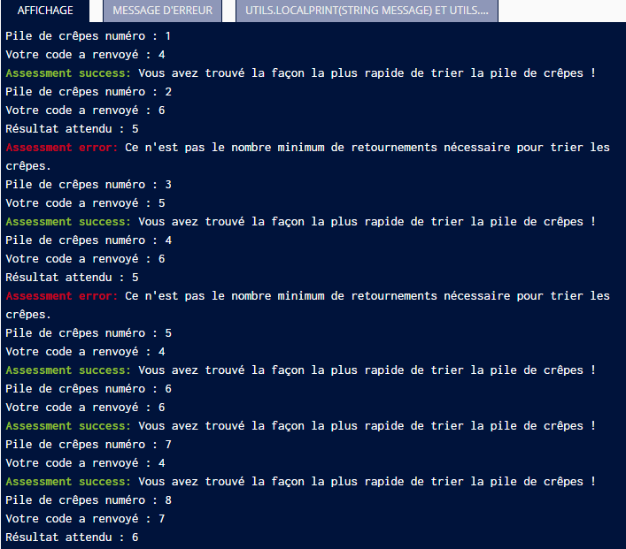

# Battle Dev RegionsJob - Mars 2018

*Disclaimer : Code écrit sous la contrainte du temps et dans un contexte de compétition*

## Tri des crêpes

### Résultat / Debrief

Presque réussi avec un algo "smart" mais qui ne résolvait pas un cas particulier. Perte de temps à rechercher un algo de résolution intelligent alors qu'il fallait faire du brute force... :/

________________________

### Objectif

Après beaucoup de temps passé à préparer de la pâte à crêpes et à la faire cuire, vous êtes soudain saisi d'une insatisfaction esthétique en regardant votre pile de crêpes : toutes vos crêpes ayant des diamètres différents, la pile ne ressemble à rien ! À défaut d'avoir des crêpes de même taille, ça serait déjà plus joli si elles étaient triées avec la plus petite en haut et la plus grande en bas.

Vous décidez donc de trier la pile en utilisant une spatule. En insérant la spatule entre la k-ième et la (k+1)-ième crêpe en partant du haut, vous pouvez retourner d'un coup les k premières crêpes de la pile. Combien de fois vous faut-il répéter ce genre d'opération avant d'obtenir une pile triée ?

Pour simplifier, on ne considérera dans cet exercice que des piles contenant exactement 6 crêpes. Il est connu que dans ce cas, il y a toujours une façon de trier en au plus 7 retournements.

Indication : cela signifie que vous pourrez donc procéder par énumération exhaustive (force brute). Cependant la mémoire utilisée par votre script ne doit pas dépasser 128Mo (ce qui est largement suffisant pour le nombre de cas à énumerer).

### Format des données

#### Entrée

Lignes 1 à 6 : un entier compris entre 15 et 50 représentant le diamètre d'une crêpe de la pile en commençant par celle du haut.

On vous garantit que les crêpes ont des diamètres différents deux à deux.

#### Sortie

Un entier, indiquant le nombre minimal de retournements requis pour obtenir une pile triée à partir de la pile donnée. 
Pour rappel, la pile triée est telle que la plus petite crêpe se trouve en haut de la pile et la plus grande crêpe se trouve en bas de la pile.

*Exemple*

Dans cet exemple, on considère des crêpes de taille comprise entre 20 et 45 cm, disposées en la pile suivante : 

45
40
35
20
25
30

En mettant la spatule tout en bas et en retournant ainsi toute la pile, on obtient :

30
25
20
35
40
45

Pour achever de trier, il ne reste plus qu'à retourner les 3 premières crêpes, en insérant la spatule entre la crêpe de 20 cm et celle de 35 cm :

20
25
30
35
40
45

Ainsi, dans cet exemple, le nombre minimum de retournements nécessaires pour trier est 2 (on peut vérifier que c'est impossible en un seul retournement).